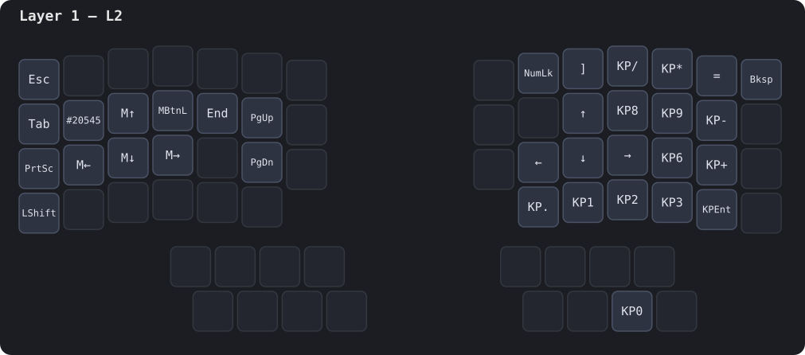
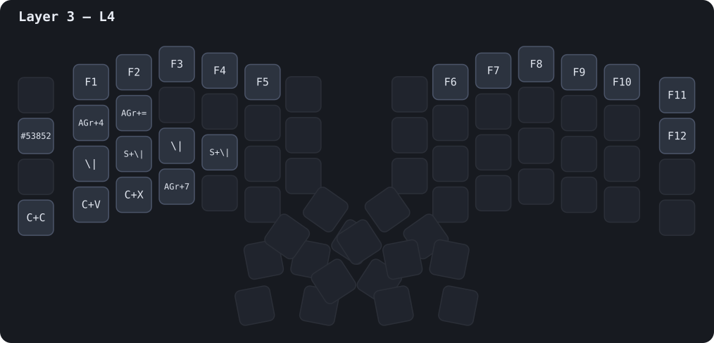

# Dygma Defy — config

Dernier backup : `20260804160109-Defy.json`  
neuronID : `200cb8077ae9b7c4`

Généré depuis les backups Bazecor par [`sync.py`](./sync.py).
Source de vérité re-flashable : [`defy.json`](./defy.json) · transcription : [`layers.yaml`](./layers.yaml).

## Layers

### Layer 0 — main

### Layer 1 — L2

### Layer 2 — L3

### Layer 3 — L4

