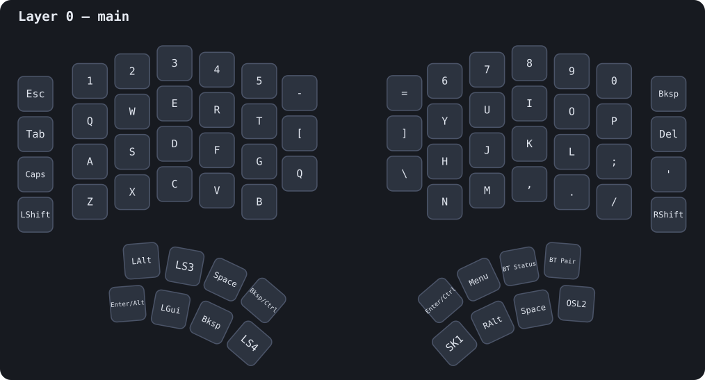
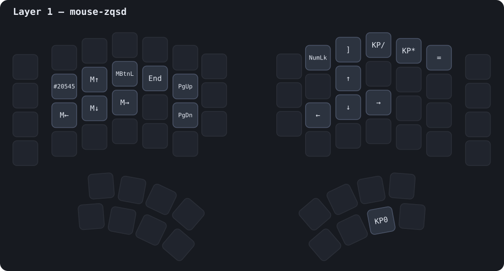
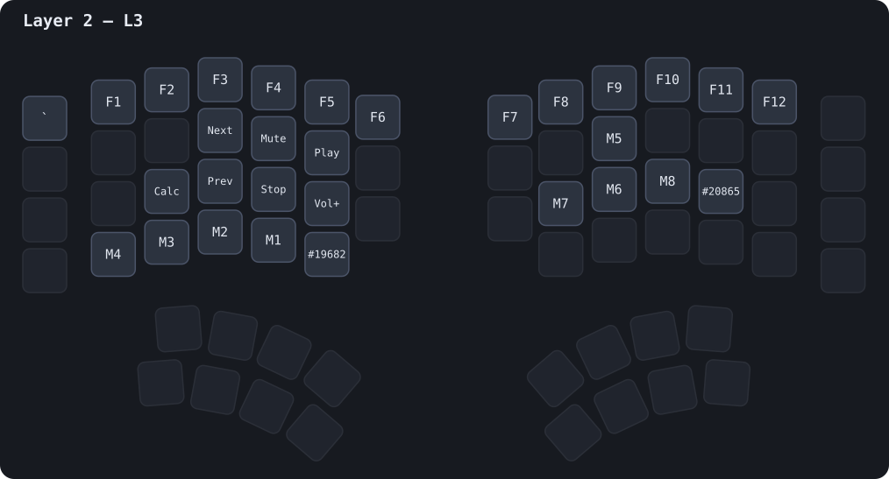
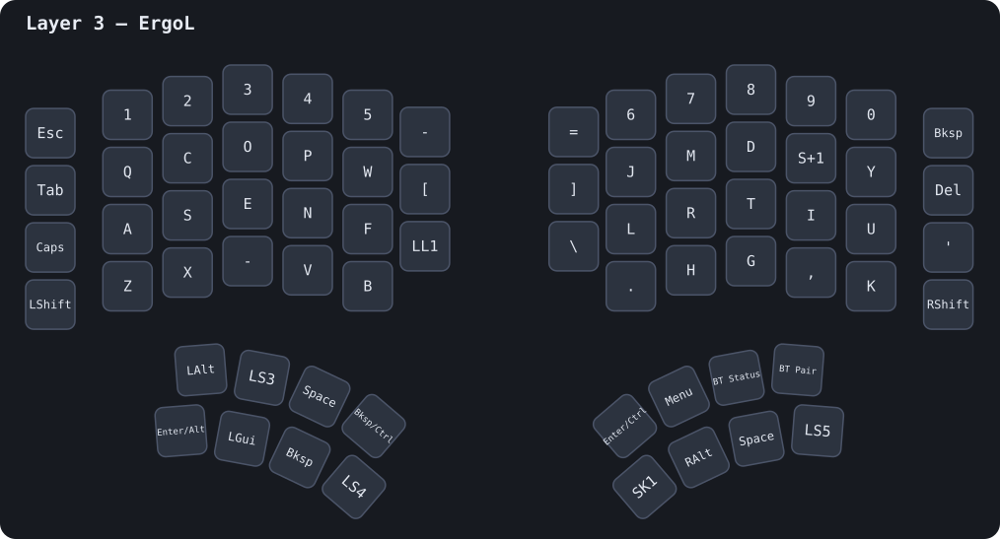
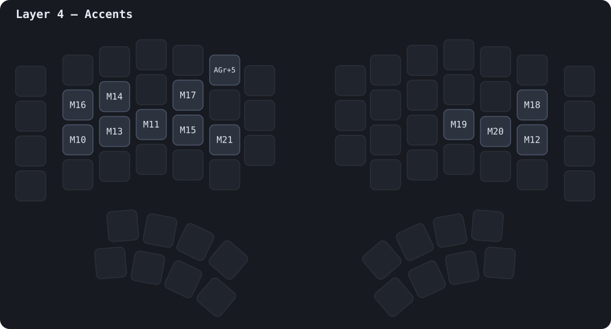

# Dygma Defy — config

Latest backup: `20260805103723-Defy.json`  
neuronID: `200cb8077ae9b7c4`

Généré depuis les backups Bazecor par [`sync.py`](./sync.py) ; sens inverse (YAML → JSON flashable) via [`restore.py`](./restore.py) (`mise run restore`).
Source ré-flashable : [`defy.json`](./defy.json) · transcription lisible : [`layers.yaml`](./layers.yaml).

## Layers

### Layer 0 — main

QWERTY de base. Dual-function sur les pouces (Bksp/Ctrl, Enter/Alt, Enter/Ctrl). Slot 38 = `Layer Lock 4` → bascule permanente vers ErgoL.

### Layer 1 — mouse-zqsd

Souris (déplacements + clics), navigation (flèches, PgUp/PgDn) et pavé numérique.

### Layer 2 — L3

Média (Play/Stop/Prev/Next/Vol±/Mute/Shuffle), F1-F12 et macros (préfixes tmux `Ctrl+B`).

### Layer 3 — ErgoL

Layout ErgoL (type Colemak FR) posé sur un OS **US** : lettres ErgoL + le « chrome » de main (chiffres, Suppr, Shift, pouces). Slot 38 = `Layer Lock 1` → retour main. Maintenir `Layer Shift 5` (pouce) → couche Accents.

### Layer 4 — Accents

Accents FR via **macros** (touches mortes US-International : `'`+e=é, `` ` ``+e=è, `^`+e=ê…) + `€` (AltGr+5). Accès en maintenant le pouce depuis ErgoL.

